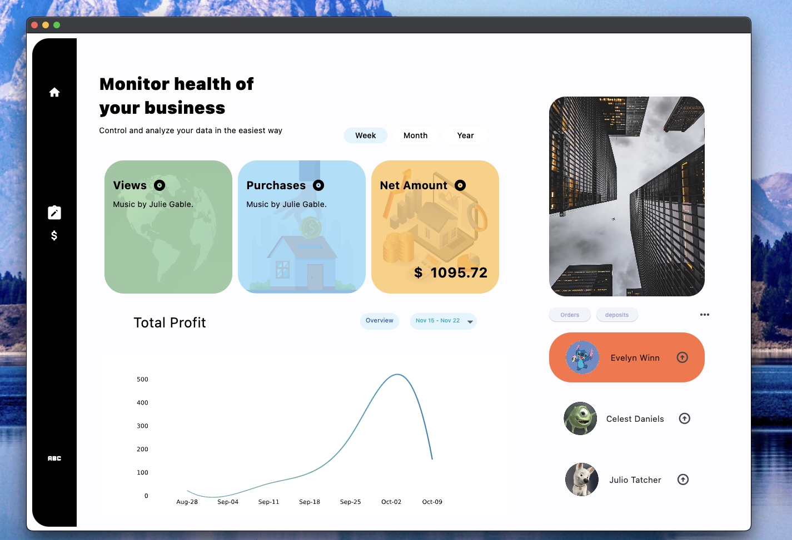
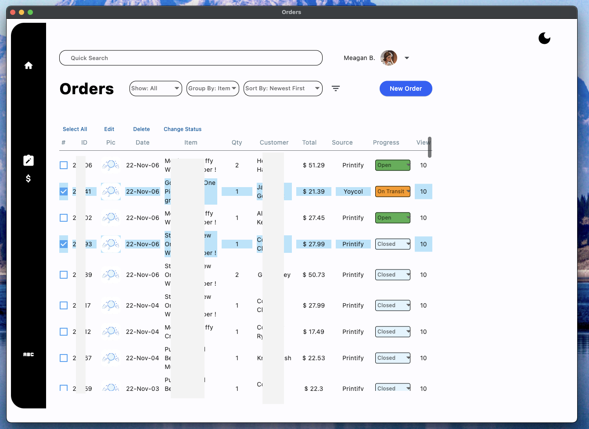

# Dashboard-Flet

Analytics Dashboard for managing an online store, created using the fantastic Flet Framework which allows you to create Flutter apps using Python.

Check out <a href="www.flet.dev">Flet</a> for more info

Other popular libraries are used= for this project to come together -> Pandas, Matplotlib, Numpy

### Quick overview of HomePage and OrdersPage
A major portion of this Single-Page-Application (SPA) is still being developed.

